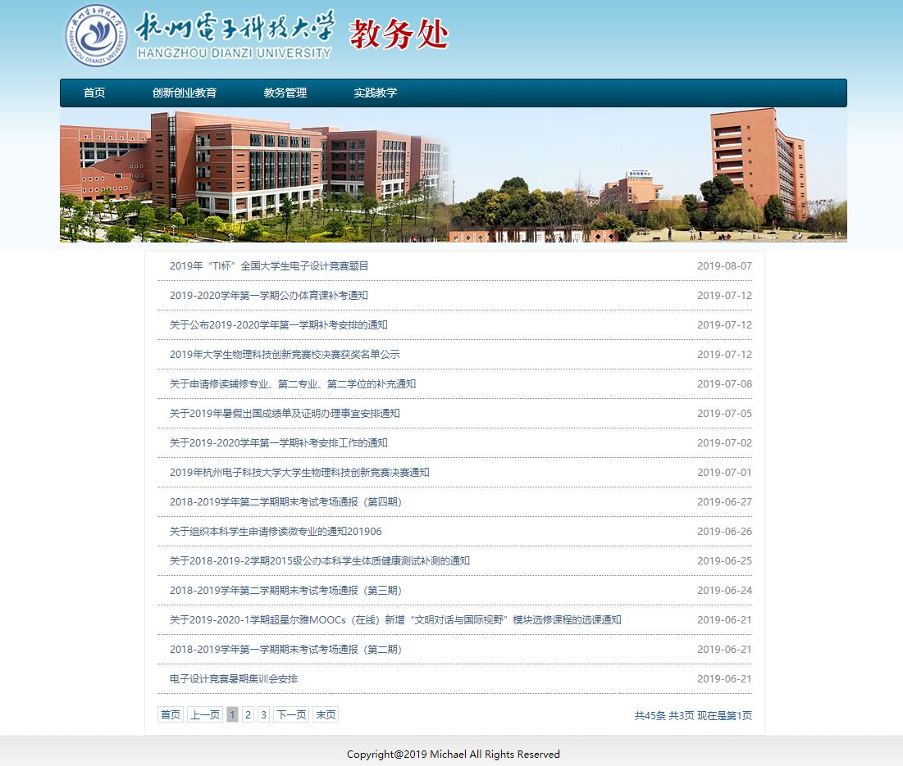

# README

This project uses python to crawl the latest announcements Administration Office of Hangzhou Dianzi University and represents with web pages. 

### Environment:

The project runs on **python 3.x** and **Java 1.7 and above**.

 Main Framework using **Springboot 2.1.7**. 

### Preparation:

**Python3**:

`crawler.py` is dependent on `BeautifulSoup4`, requests and `pymysql` libraries. Make sure these libraries are installed before you run.

```bash
$ pip3 install bs4;
$ pip3 install requests;
$ pip3 install pymysql
```

**Database**:

In local database(**MySQL**): create four tables: 'together'(汇总),'cxcy'（创新创业）,'jwgl'（教务管理）,'sj'（实践教育），which represents different sections of the Administration Office. 

For each table, create 4 fields: 

id (auto-increment,type:int,length:11), 

title(unique,type:varchar, length:255),

time(type:date, length:12), 

link(varchar, type:varchar,length:255).

That's where the name of class TTL comes from(Title, Time, Link).

**Configuration**:

In `crawler.py`, change `__db_url`,`__db_user`,`__db_password`,`__db_name` to the URL, user name,password and database name of your `MySQL`.   Configure the same thing in `application.yml` ,and in `SectionMapper.xml`, adapt **local** to your database name. 

Default server port is `5000`. You can choose another port by editing `application.yml`.   

Log file and its path also need configuration to adapt to your environment.

#### ALERT:

On some Linux servers, default python version is 2.x. You have to specify `python3` to run `crawler.py`. If so,on the 20th line of `src/main/java/com/michael/hdujwc/schedule/Task`, rewrite 'python' to 'python3' before you run the project.

### Run:

Run the project either through IDE or by packaging the project into JAR or WAR.



